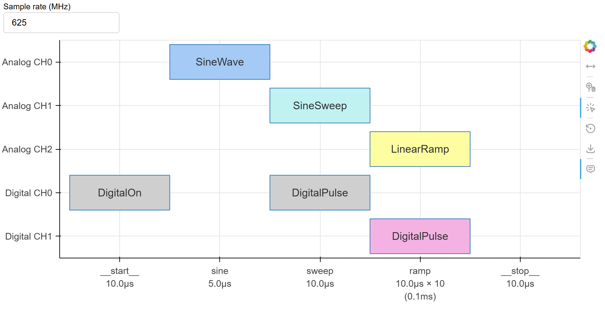
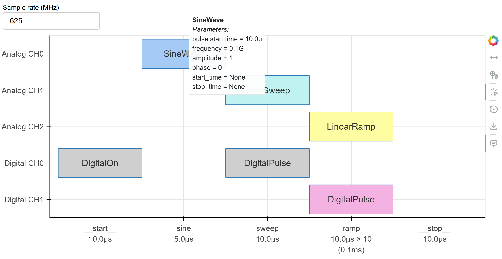
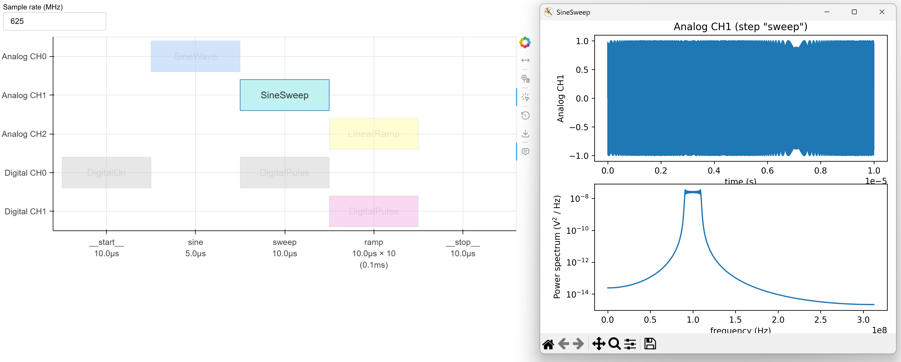
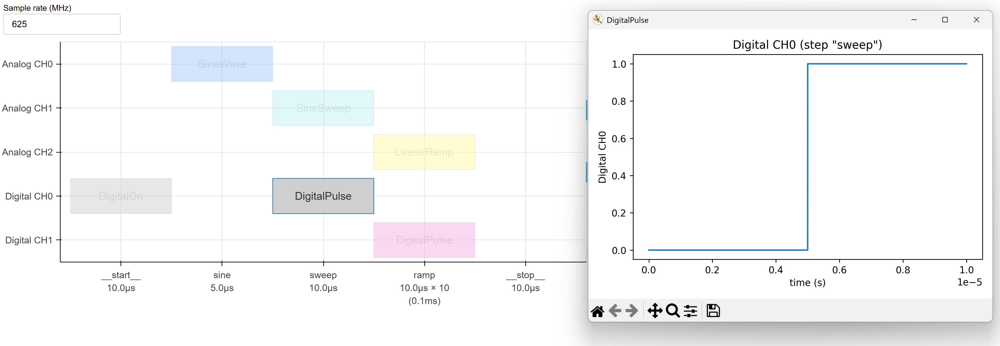
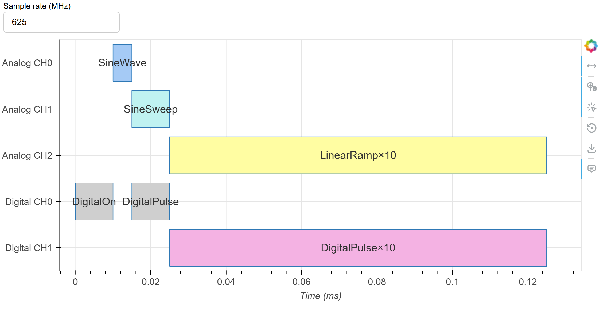

How to plot a sequence diagram
===================================

A :class:`~qfabric.sequence.sequence.Sequence` object can be visualized in following two ways.
We define the sequence to be visualized first.

.. code-block:: python

    from qfabric import (
       DigitalPulse,
       LinearRamp,
       Sequence,
       SineSweep,
       SineWave,
       Step,
    )

    step = Step("sine")
    step.add_analog_function(0, SineWave(100e6, 1))
    step.duration = 5e-6
    sequence.add_step(step)
    
    step = Step("sweep")
    step.add_analog_function(1, SineSweep(90e6, 110e6, 1, 1, 0, 1e-5))
    step.add_digital_function(0, DigitalPulse(5e-6, 1e-5))
    sequence.add_step(step)
    
    step = Step("ramp")
    step.add_analog_function(2, LinearRamp(-1, 1, 0, 1e-5))
    step.add_digital_function(1, DigitalPulse(5e-6, 1e-5))

Logic view
---------------------
Use :meth:`~qfabric.visualizer.plot.logic_sequence` to view a sequence in the logic view,
where each step is depicted as equal length.

.. code-block:: python

    from qfabric import logic_sequence

    logic_sequence(sequence)

This opens up a new browser window with the following figure:

Hovering the mouse on a function shows the fields of the function.

Clicking on an analog function shows its temporal trace and spectral power in a new window:

Clicking on a digital function shows its temporal trace too:

You can change the sample rate before clicking on a function. If the sample rate is too high
it may take a long time to plot.

Clicking anywhere on the plot closes the active function plot window. 

Timeline view
---------------------

Use :meth:`~qfabric.visualizer.plot.timeline_sequence` to view a sequence in the logic view,
where each step is depicted proportional to its duration.

.. code-block:: python

    from qfabric import timeline_sequence

    timeline_sequence(sequence)

It shows the following plot. Clicking on function blocks shows its details, similar to the logic plot.

